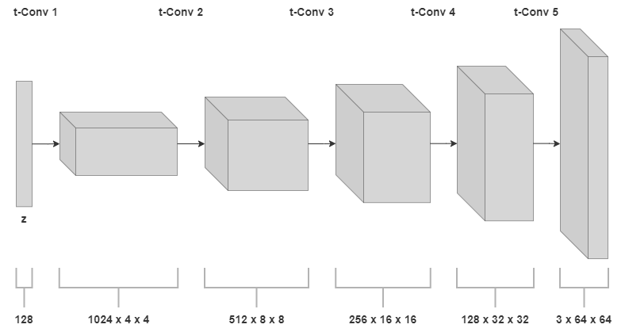
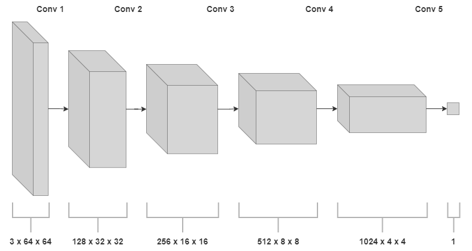
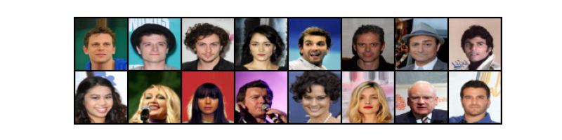
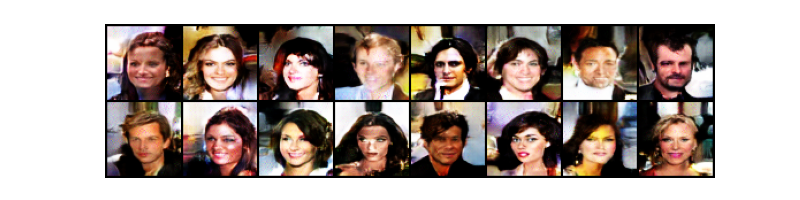

# DCGAN CelebA

## Project Description
The notebook shows how to implement and train a Deep Convolutional GAN (DCGAN) model to perform image synthesis on the CelebA (CelebFaces Attributes) dataset, which contains just over 200 thousand face images from over 10 thousand celebrities with different pose variations and backgrounds. The code is developed entirely using the PyTorch library.

### Model Architecture
The proposed implementation tries to follow the guidelines set out in the original DCGAN paper, but also includes some more advanced regularization techniques. In detail, the generator is composed of fractional-strided (transposed) convolution layers, to upsample the latent vector, while the discriminator consists of simple strided convolutions. Fully connected layers are avoided, and batch normalization is applied after every convolution layer, both in the discriminator and generator. Furthermore, ReLU activations are used in the generator (only the final layer uses a hyperbolic tangent activation), while LeakyReLU functions are used in the discriminator. The optimizer of choice is Adam, and the loss function used is a modified binary cross-entropy (BCE). Finally, all weights are initialized following a Normal distribution.
On top of that, since early experiments with this configuration showed signs of mode collapse and non-convergence, the following regularization techniques are also adopted in the code:

- Spectral normalization
- One-sided label smoothing
- Gaussian noise
- Spatial dropout
- Separate mini-batches
- Different learning rates for generator and discriminator

The follwing plots show the architecture components with output shape for every convolutional layer:

  
   Generator network.

 

  
   Discriminator network.

### Training Example
To provide an example of the model capabilities, the DCGAN described above and coded in the notebook was trained for 60 epochs on a Tesla T4 Cloud GPU, with a batch size of 128, a latent vector size of 128, and image size of 64 × 64. No extra data augmentations were applied to the training data, except scaling their range and applying a random horizontal flip.
The images below compare generated outputs after the final epoch and a sample of real training data:

  
   Real data.

 

  
   Genereted data.

While still not perfect and with room for improvement, the results are impressive, considering the small size of the model (below 25 million parameters), the low resolution of the images and the limited amount of training data and resources available. Moreover, proper regularization avoided the issues of non-convergence and mode collapse.

## References
- [https://arxiv.org/abs/1511.06434](https://arxiv.org/abs/1511.06434)
- [https://arxiv.org/abs/1606.03498](https://arxiv.org/abs/1606.03498)
- [https://arxiv.org/abs/1701.04862](https://arxiv.org/abs/1701.04862)
- [https://arxiv.org/abs/1411.7766](https://arxiv.org/abs/1411.7766)

